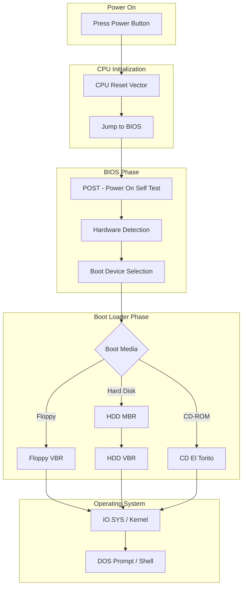
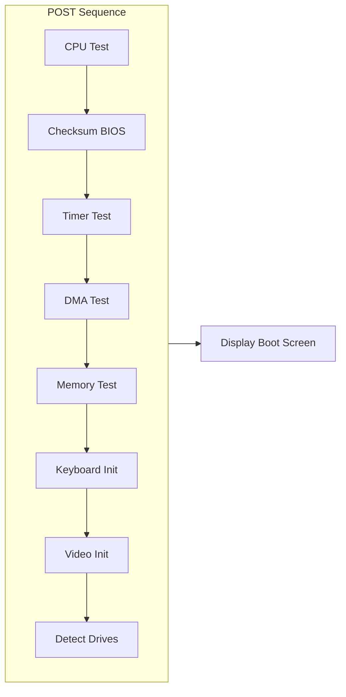
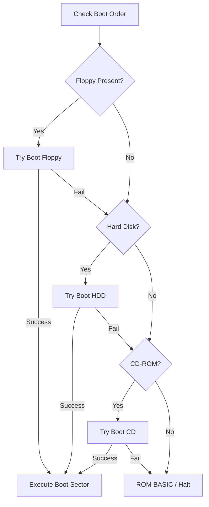
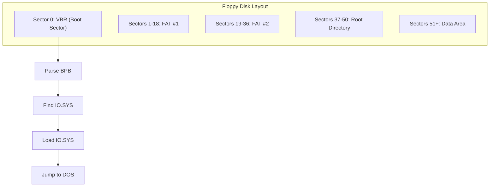
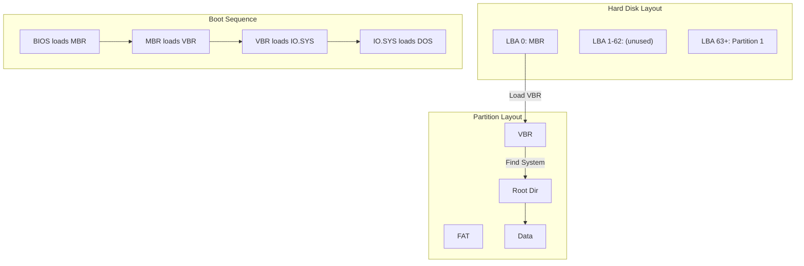
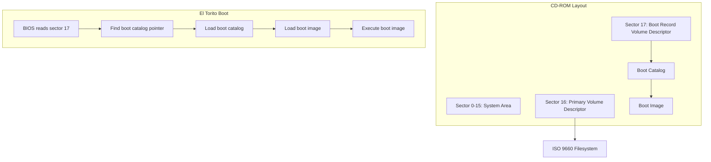
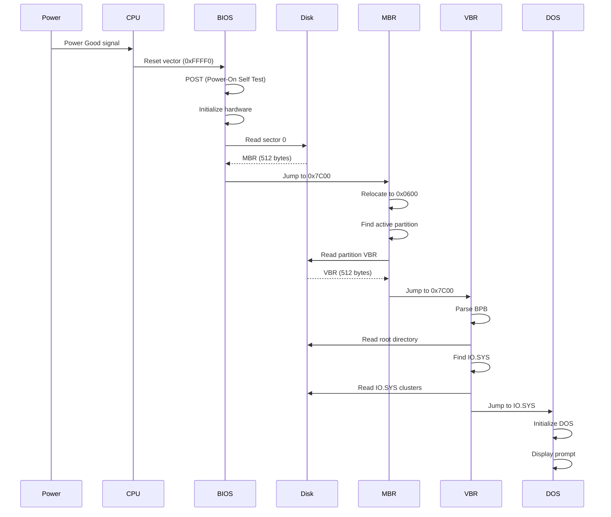

# PC Boot Process: From Power-On to Operating System

A comprehensive guide to understanding how a PC boots, from the moment you press the power button to when you see the DOS prompt.

## Table of Contents

1. [Overview](#overview)
2. [CPU Reset and Power-On](#cpu-reset-and-power-on)
3. [BIOS Initialization](#bios-initialization)
4. [Boot Device Selection](#boot-device-selection)
5. [Floppy Boot Process](#floppy-boot-process)
6. [Hard Disk Boot Process](#hard-disk-boot-process)
7. [CD-ROM Boot Process](#cd-rom-boot-process)
8. [Memory Maps](#memory-maps)
9. [Data Structures](#data-structures)
10. [Practical Examples](#practical-examples)

---

## Overview

The PC boot process is a carefully orchestrated sequence that transforms a powered-off machine into a running operating system.



---

## CPU Reset and Power-On

### What Happens at Power-On

When you press the power button:

1. **Power Supply** generates "Power Good" signal after ~100-500ms
2. **CPU** receives reset signal on RESET pin
3. **CPU** begins executing at reset vector

### The Reset Vector

The x86 CPU has a hardcoded starting point:

```
┌─────────────────────────────────────────────────────────────────┐
│                     x86 RESET STATE                              │
├─────────────────────────────────────────────────────────────────┤
│  Register   │  Value       │  Notes                             │
├─────────────┼──────────────┼────────────────────────────────────┤
│  CS         │  0xF000      │  Code segment                      │
│  IP         │  0xFFF0      │  Instruction pointer               │
│  Flags      │  0x0002      │  Interrupts disabled               │
│  All others │  0x0000      │  Cleared                           │
└─────────────┴──────────────┴────────────────────────────────────┘

Physical Address = CS × 16 + IP = 0xFFFF0

This address (0xFFFF0) is 16 bytes below the 1MB mark.
BIOS ROM is mapped here and contains a JMP instruction.
```

### First Instruction

```asm
; At address 0xFFFF0 (in BIOS ROM):
    jmp far 0xF000:0xE05B    ; Jump to actual BIOS code

; This is only 5 bytes, fitting in the 16 bytes before 1MB limit
```

---

## BIOS Initialization

### POST (Power-On Self Test)



### POST Codes

During POST, the BIOS writes codes to port 0x80 (diagnostic port):

| Code | Meaning |
|------|---------|
| 0x00 | CPU test |
| 0x01 | Reset flags |
| 0x03 | Initialize chipset |
| 0x10 | Test DMA |
| 0x20 | Test base memory |
| 0x30 | Test extended memory |
| 0xC0 | Test floppy |
| 0xD0 | Test hard disk |
| 0xFF | Boot attempt |

### BIOS Data Area (BDA)

The BIOS initializes a data area in low memory:

```
┌──────────────────────────────────────────────────────────────────┐
│              BIOS DATA AREA (0x0400 - 0x04FF)                     │
├──────────────────────────────────────────────────────────────────┤
│ 0x0400-0x0407: COM port addresses (COM1-COM4)                     │
│ 0x0408-0x040F: LPT port addresses (LPT1-LPT4)                     │
│ 0x0410-0x0411: Equipment flags                                    │
│ 0x0413-0x0414: Base memory size in KB                             │
│ 0x041E-0x043D: Keyboard buffer                                    │
│ 0x0449:        Current video mode                                 │
│ 0x044A-0x044B: Screen columns                                     │
│ 0x046C-0x046F: Timer tick count                                   │
│ 0x0472:        Soft reset flag (0x1234 = warm boot)               │
│ 0x0475:        Number of hard disks                               │
└──────────────────────────────────────────────────────────────────┘
```

---

## Boot Device Selection

### Boot Order

BIOS checks devices in configured order:



### INT 19h - Bootstrap Loader

```asm
; BIOS Boot sequence (simplified)
boot:
    ; Try each device in order
    mov dl, 0x00        ; First floppy
    call try_boot
    jnc .success

    mov dl, 0x80        ; First hard disk
    call try_boot
    jnc .success

    ; No bootable device
    int 18h             ; ROM BASIC or halt

.success:
    ; Loaded boot sector to 0x7C00
    jmp 0x0000:0x7C00   ; Execute it!

try_boot:
    ; Read sector 0 to 0x7C00
    mov ax, 0x0201      ; Read 1 sector
    mov cx, 0x0001      ; Cylinder 0, Sector 1
    mov dh, 0x00        ; Head 0
    mov bx, 0x7C00      ; Buffer address
    int 13h             ; Disk services
    jc .fail

    ; Check boot signature
    cmp word [0x7DFE], 0xAA55
    jne .fail

    clc
    ret

.fail:
    stc
    ret
```

---

## Floppy Boot Process

Floppy disks don't have an MBR - the first sector IS the VBR.



### Floppy BPB Example (1.44MB)

```
┌────────────────────────────────────────────────────────────────┐
│            1.44MB FLOPPY BPB (DOS Format)                       │
├────────────────────────────────────────────────────────────────┤
│ Bytes/Sector:     512                                           │
│ Sectors/Cluster:  1                                             │
│ Reserved Sectors: 1                                             │
│ Number of FATs:   2                                             │
│ Root Entries:     224                                           │
│ Total Sectors:    2880                                          │
│ Media Byte:       0xF0                                          │
│ Sectors/FAT:      9                                             │
│ Sectors/Track:    18                                            │
│ Heads:            2                                             │
│ Hidden Sectors:   0                                             │
└────────────────────────────────────────────────────────────────┘

Calculated Values:
  FAT Start:     Sector 1
  Root Start:    Sector 1 + (2 × 9) = Sector 19
  Root Sectors:  (224 × 32) / 512 = 14 sectors
  Data Start:    Sector 19 + 14 = Sector 33
  Data Clusters: (2880 - 33) / 1 = 2847 clusters
```

---

## Hard Disk Boot Process

Hard disks use a two-stage boot: MBR → VBR.



### MBR Memory Flow

```
┌─────────────────────────────────────────────────────────────────┐
│                    MBR EXECUTION FLOW                            │
└─────────────────────────────────────────────────────────────────┘

Step 1: BIOS loads MBR to 0x7C00
┌──────────────────────────────────────┐
│ 0x7C00: MBR Code + Partition Table   │
│ 0x7DFE: 55 AA (signature)            │
└──────────────────────────────────────┘

Step 2: MBR relocates to 0x0600
┌──────────────────────────────────────┐
│ 0x0600: MBR Code (relocated)         │
│ 0x07FE: 55 AA                        │
└──────────────────────────────────────┘
┌──────────────────────────────────────┐
│ 0x7C00: (now free for VBR)           │
└──────────────────────────────────────┘

Step 3: MBR loads VBR to 0x7C00
┌──────────────────────────────────────┐
│ 0x7C00: VBR + BPB                    │
│ 0x7DFE: 55 AA                        │
└──────────────────────────────────────┘

Step 4: MBR jumps to 0x7C00 (VBR takes over)
```

### Partition Table Structure

```
┌─────────────────────────────────────────────────────────────────┐
│                MBR STRUCTURE (512 bytes)                         │
├───────────┬─────────────────────────────────────────────────────┤
│  Offset   │  Content                                             │
├───────────┼─────────────────────────────────────────────────────┤
│  0x000    │  Boot code (446 bytes)                               │
│  0x1BE    │  Partition Entry 1 (16 bytes)                        │
│  0x1CE    │  Partition Entry 2 (16 bytes)                        │
│  0x1DE    │  Partition Entry 3 (16 bytes)                        │
│  0x1EE    │  Partition Entry 4 (16 bytes)                        │
│  0x1FE    │  Boot signature (0x55, 0xAA)                         │
└───────────┴─────────────────────────────────────────────────────┘

Partition Entry (16 bytes):
┌─────────┬───────┬─────────────────────────────────────────────────┐
│ Offset  │ Size  │ Content                                          │
├─────────┼───────┼─────────────────────────────────────────────────┤
│ 0x00    │ 1     │ Boot flag (0x80=active, 0x00=inactive)           │
│ 0x01    │ 1     │ Starting head                                    │
│ 0x02    │ 1     │ Starting sector (bits 0-5) + cyl high (6-7)      │
│ 0x03    │ 1     │ Starting cylinder (low 8 bits)                   │
│ 0x04    │ 1     │ Partition type (0x06=FAT16, 0x0B=FAT32, etc.)    │
│ 0x05    │ 1     │ Ending head                                      │
│ 0x06    │ 1     │ Ending sector + cylinder high                    │
│ 0x07    │ 1     │ Ending cylinder                                  │
│ 0x08    │ 4     │ Starting LBA (32-bit)                            │
│ 0x0C    │ 4     │ Partition size in sectors (32-bit)               │
└─────────┴───────┴─────────────────────────────────────────────────┘
```

---

## CD-ROM Boot Process

CD-ROMs use the "El Torito" specification for booting.



### El Torito Boot Record

```
┌─────────────────────────────────────────────────────────────────┐
│         EL TORITO BOOT RECORD (Sector 17)                        │
├───────────┬─────────────────────────────────────────────────────┤
│  Offset   │  Content                                             │
├───────────┼─────────────────────────────────────────────────────┤
│  0x00     │  Boot Record Indicator (0x00)                        │
│  0x01-05  │  ISO 9660 Identifier ("CD001")                       │
│  0x06     │  Version (0x01)                                      │
│  0x07-26  │  Boot System Identifier ("EL TORITO SPECIFICATION") │
│  0x47-4A  │  Pointer to Boot Catalog (32-bit sector number)      │
└───────────┴─────────────────────────────────────────────────────┘
```

### Boot Emulation Modes

| Mode | Description |
|------|-------------|
| No Emulation | Boot directly from CD sectors |
| 1.2MB Floppy | Emulate 1.2MB floppy disk |
| 1.44MB Floppy | Emulate 1.44MB floppy disk |
| 2.88MB Floppy | Emulate 2.88MB floppy disk |
| Hard Disk | Emulate hard disk (includes MBR) |

---

## Memory Maps

### Real Mode Memory Map

```
┌─────────────────────────────────────────────────────────────────┐
│              x86 REAL MODE MEMORY MAP (1MB)                      │
├─────────────────────────────────────────────────────────────────┤
│                                                                  │
│  0xFFFFF ┌────────────────────────────────────┐                  │
│          │                                    │                  │
│  0xF0000 │        BIOS ROM (64KB)             │  High Memory     │
│          │                                    │                  │
│  0xE0000 ├────────────────────────────────────┤                  │
│          │   Extended BIOS Data / ROMs        │                  │
│  0xC8000 ├────────────────────────────────────┤                  │
│          │      Video BIOS ROM (32KB)         │                  │
│  0xC0000 ├────────────────────────────────────┤                  │
│          │                                    │                  │
│  0xB8000 │   Text Video Memory (32KB)         │  Video Memory    │
│          │   (Color text mode at 0xB8000)     │                  │
│  0xB0000 │   (Mono text mode at 0xB0000)      │                  │
│          │                                    │                  │
│  0xA0000 │   Graphics Video Memory (64KB)     │                  │
│          │                                    │                  │
│  0x9FFFF ├────────────────────────────────────┤                  │
│          │                                    │                  │
│          │     CONVENTIONAL MEMORY            │                  │
│          │         (~640KB)                   │                  │
│          │                                    │                  │
│          │  ┌─ 0x7E00+ Free Memory ──────┐   │                  │
│          │  │                             │   │                  │
│  0x07C00 │  │ BOOT SECTOR (512 bytes)    │   │  Boot Area       │
│          │  │                             │   │                  │
│          │  └────────────────────────────┘   │                  │
│  0x07BFF │       Stack (grows down)          │                  │
│          │                                    │                  │
│  0x00600 │  ┌─ Relocated MBR ───────────┐   │                  │
│          │  └────────────────────────────┘   │                  │
│  0x00500 ├────────────────────────────────────┤                  │
│          │     BIOS Data Area (256 bytes)     │  System Area     │
│  0x00400 ├────────────────────────────────────┤                  │
│          │  Interrupt Vector Table (1KB)      │                  │
│  0x00000 └────────────────────────────────────┘                  │
│                                                                  │
└─────────────────────────────────────────────────────────────────┘
```

### DOS Memory Layout After Boot

```
┌─────────────────────────────────────────────────────────────────┐
│              DOS MEMORY LAYOUT                                   │
├─────────────────────────────────────────────────────────────────┤
│                                                                  │
│  0x9FFFF ┌────────────────────────────────────┐                  │
│          │                                    │                  │
│          │    FREE MEMORY                     │                  │
│          │    (for user programs)             │                  │
│          │                                    │                  │
│          ├────────────────────────────────────┤                  │
│          │    COMMAND.COM (transient)         │                  │
│          ├────────────────────────────────────┤                  │
│          │    Environment Variables           │                  │
│          ├────────────────────────────────────┤                  │
│          │    DOS Buffers & Structures        │                  │
│          ├────────────────────────────────────┤                  │
│          │    Device Drivers (CONFIG.SYS)     │                  │
│          ├────────────────────────────────────┤                  │
│          │    MSDOS.SYS (DOS Kernel)          │                  │
│          ├────────────────────────────────────┤                  │
│          │    IO.SYS (BIOS)                   │                  │
│  0x00600 ├────────────────────────────────────┤                  │
│          │    BIOS Data Area                  │                  │
│  0x00400 ├────────────────────────────────────┤                  │
│          │    Interrupt Vector Table          │                  │
│  0x00000 └────────────────────────────────────┘                  │
│                                                                  │
└─────────────────────────────────────────────────────────────────┘
```

---

## Data Structures

### Interrupt Vector Table

```
┌─────────────────────────────────────────────────────────────────┐
│         INTERRUPT VECTOR TABLE (0x0000-0x03FF)                   │
├───────────┬─────────────────────────────────────────────────────┤
│  Vector   │  Description                                         │
├───────────┼─────────────────────────────────────────────────────┤
│  INT 00h  │  Divide by zero                                      │
│  INT 01h  │  Single step (debug)                                 │
│  INT 02h  │  NMI (Non-Maskable Interrupt)                        │
│  INT 03h  │  Breakpoint                                          │
│  INT 04h  │  Overflow                                            │
│  INT 08h  │  Timer tick (18.2 Hz)                                │
│  INT 09h  │  Keyboard                                            │
│  INT 10h  │  Video services                                      │
│  INT 13h  │  Disk services                                       │
│  INT 16h  │  Keyboard services                                   │
│  INT 19h  │  Bootstrap loader                                    │
│  INT 1Ah  │  Time of day                                         │
│  INT 21h  │  DOS services (after DOS loads)                      │
└───────────┴─────────────────────────────────────────────────────┘

Each entry is 4 bytes: 2-byte offset + 2-byte segment
Physical address = segment × 16 + offset
```

### FAT Directory Entry

```
┌─────────────────────────────────────────────────────────────────┐
│          FAT DIRECTORY ENTRY (32 bytes)                          │
├───────────┬───────┬─────────────────────────────────────────────┤
│  Offset   │ Size  │  Content                                     │
├───────────┼───────┼─────────────────────────────────────────────┤
│  0x00     │ 8     │  Filename (space-padded)                     │
│  0x08     │ 3     │  Extension (space-padded)                    │
│  0x0B     │ 1     │  Attributes                                  │
│  0x0C     │ 1     │  Reserved (Windows NT)                       │
│  0x0D     │ 1     │  Creation time (10ms units)                  │
│  0x0E     │ 2     │  Creation time                               │
│  0x10     │ 2     │  Creation date                               │
│  0x12     │ 2     │  Last access date                            │
│  0x14     │ 2     │  First cluster high (FAT32 only)             │
│  0x16     │ 2     │  Last modification time                      │
│  0x18     │ 2     │  Last modification date                      │
│  0x1A     │ 2     │  First cluster low                           │
│  0x1C     │ 4     │  File size in bytes                          │
└───────────┴───────┴─────────────────────────────────────────────┘

Attribute Bits:
  Bit 0 (0x01): Read-only
  Bit 1 (0x02): Hidden
  Bit 2 (0x04): System
  Bit 3 (0x08): Volume label
  Bit 4 (0x10): Directory
  Bit 5 (0x20): Archive
  Bits 0-3 all set (0x0F): Long filename entry
```

### FAT Cluster Chain

```
FAT Entry Values:
┌─────────────────────────────────────────────────────────────────┐
│  FAT12     │  FAT16     │  FAT32       │  Meaning               │
├────────────┼────────────┼──────────────┼────────────────────────┤
│  0x000     │  0x0000    │  0x00000000  │  Free cluster          │
│  0x001     │  0x0001    │  0x00000001  │  Reserved              │
│  0x002-    │  0x0002-   │  0x00000002- │  Next cluster in       │
│  0xFF6     │  0xFFEF    │  0x0FFFFFEF  │  chain                 │
│  0xFF7     │  0xFFF7    │  0x0FFFFFF7  │  Bad cluster           │
│  0xFF8-    │  0xFFF8-   │  0x0FFFFFF8- │  End of chain          │
│  0xFFF     │  0xFFFF    │  0x0FFFFFFF  │                        │
└────────────┴────────────┴──────────────┴────────────────────────┘

Example Cluster Chain:
  File starts at cluster 5, spans 4 clusters

  ┌───────┬───────┬───────┬───────┬───────┬───────┐
  │ FAT[2]│ FAT[3]│ FAT[4]│ FAT[5]│ FAT[6]│ FAT[7]│...
  ├───────┼───────┼───────┼───────┼───────┼───────┤
  │ 0x0000│ 0x0000│ 0x0000│  0x06 │  0x09 │ 0x0000│
  └───────┴───────┴───────┴───────┴───────┴───────┘
                          ↓       ↓
  ┌───────┬───────┬───────┬───────┬────────┐
  │ FAT[8]│ FAT[9]│FAT[10]│FAT[11]│FAT[12] │...
  ├───────┼───────┼───────┼───────┼────────┤
  │ 0x0000│  0x0B │ 0x0000│ 0xFFFF│ 0x0000 │
  └───────┴───────┴───────┴───────┴────────┘
                          ↓
  Chain: 5 → 6 → 9 → 11 → END
```

---

## Practical Examples

### Example 1: Create Bootable Floppy

```bash
# 1. Create empty floppy image
dd if=/dev/zero of=floppy.img bs=512 count=2880

# 2. Write boot sector
nasm -f bin -o boot.bin boot.asm
dd if=boot.bin of=floppy.img bs=512 count=1 conv=notrunc

# 3. Format with FAT12 (preserving boot sector)
# The boot sector includes BPB, so this creates the FAT

# 4. Copy system files
mcopy -i floppy.img IO.SYS ::
mcopy -i floppy.img MSDOS.SYS ::
mcopy -i floppy.img COMMAND.COM ::

# 5. Test with QEMU
qemu-system-i386 -fda floppy.img
```

### Example 2: Examine Boot Sector

```bash
# View MBR hex dump
xxd -l 512 disk.img | head -32

# Disassemble boot code
ndisasm -b 16 -o 0x7c00 disk.img | head -50

# Extract partition table
dd if=disk.img bs=1 skip=446 count=64 | xxd
```

### Example 3: Debug Boot Process

```bash
# Run QEMU with debugging
qemu-system-i386 -hda disk.img -S -s &

# Connect GDB
gdb
(gdb) target remote :1234
(gdb) set architecture i8086
(gdb) break *0x7c00
(gdb) continue
(gdb) x/20i $eip
```

---

## Summary Diagram



---

## Further Reading

- [OSDev Wiki - Boot Sequence](https://wiki.osdev.org/Boot_Sequence)
- [The Starman's Boot Sector Pages](https://thestarman.pcministry.com/asm/mbr/)
- [Microsoft FAT Specification](https://download.microsoft.com/download/1/6/1/161ba512-40e2-4cc9-843a-923143f3456c/fatgen103.doc)
- [El Torito Specification](https://pdos.csail.mit.edu/6.828/2018/readings/boot-cdrom.pdf)
- [Ralph Brown's Interrupt List](http://www.ctyme.com/rbrown.htm)
